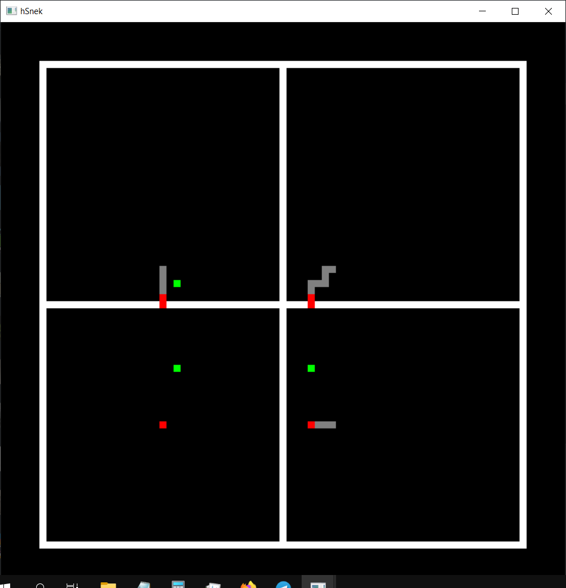

# hSnek

This is a simple 4d game of snake, projected on 4 separate 2d planes, each of 4 lines in the middle represents one coordinate axis.

# Installation

Download .zip from releases -> ensure that dll and exe are in the same directory -> done

# Controls

WASD, arrow keys - movement
R - restart
(controls only work with an English keyboard layout)
