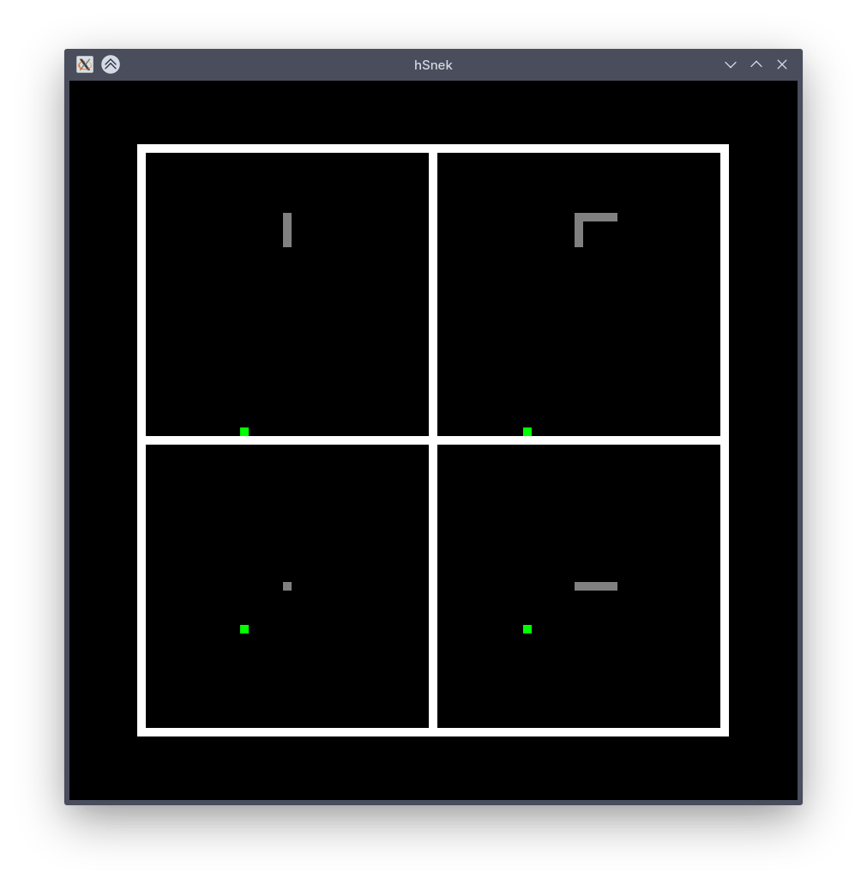

# hSnek

<p align="center">
  
</p>

This is a simple 4D Snake game, projected on 4 separate 2D planes, each of 4 lines in the middle represents one coordinate axis.

## Installation

### From releases (Windows-only)

Download .zip from releases -> ensure that dll and exe are in the same directory -> done

### From source

```sh
git clone https://github.com/DEYTD/hSnek.git
cd hSnek
stack build apecs-gloss
stack ghc hSnek.hs
```

## Controls

WASD, arrow keys - movement
R - restart
(controls only work with an English keyboard layout)
